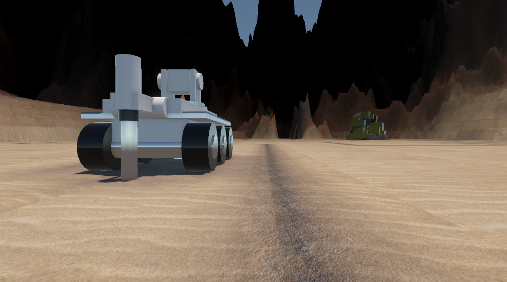
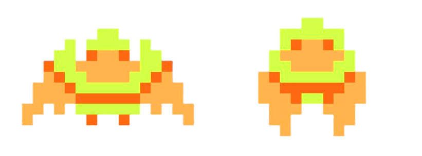

# Trent Mullin — Video Game Portfolio (EECS 494)

Unity / C# rapid prototypes focused on **gameplay systems**, **iteration speed**, and **player feedback**.

---

# Rover Rush — P2 Gold (Final Prototype)

**Top-down rover defense + base building.**  
Build structures under pressure, manage resources (Sand / Iron / Copper / Gold), and survive escalating bug waves. The rover fabricates placed structures in-world and can be redirected via a waypoint tool for repositioning.

**Play / Download:**  
- Rover Rush: **[LINK HERE]**  

## My Contributions (Solo)
- Implemented build mode tooling (waypoint + multiple build tools), placement/queue system, and prefab fabrication flow  
- Built rover AI behavior: waypoint driving, build targeting, timed fabrication, and in-world feedback  
- Implemented economy expansion: multi-resource bank, costs per structure, and real-time UI updates  
- Implemented wave director flow: start screen → intro camera sequence → prep/wave cycles → game over  
- Added polish systems: reticle state, “insufficient resources” feedback, and event-driven SFX triggers

## Technology
- **Engine:** Unity  
- **Language:** C#  
- **Systems:** EventBus / Pub-Sub architecture, TMP UI, coroutines + state machines  

---

# The Legend of Zelda — First Dungeon Recreation (P1 Gold)

A faithful recreation of the first dungeon from the original *The Legend of Zelda*, built in Unity as a top-down 2D adventure game inside a 3D environment. Includes a custom mechanic: **Keese Mode**.

**Play:**  
- Zelda Dungeon: https://trullin.itch.io/trullin-zelda-dungeon

## My Contributions
- Coroutine-based room transitions between dungeon chambers  
- Environmental mechanics and interaction logic  
- Power-up systems + support work for Link → Keese transformation  
- Designed and built a custom demo map to showcase the Keese mechanic

## Technology
- Unity, C#, Git, Jira sprint planning

---

## Notes 
- Real-time game state management
- Coroutines for visual and mechanical transitions
- Collaborative version control workflows
- Structuring gameplay systems in Unity
- Designing mechanics that extend classic gameplay without breaking balance

Working in a team environment on a structured milestone schedule provided valuable experience in collaborative development and production pacing.

---

## Play the Demo

You can try the finished build here:

https://trullin.itch.io/trullin-zelda-dungeon

