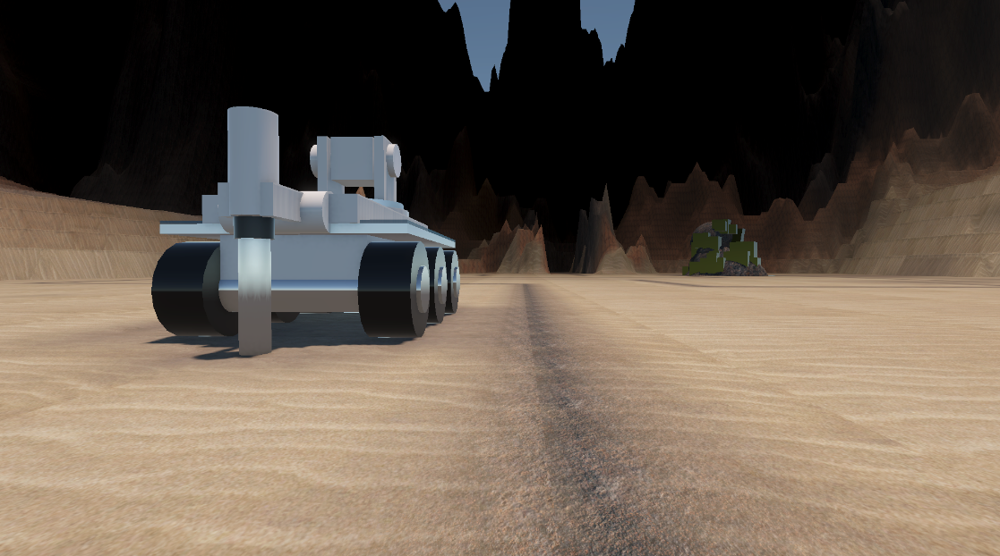
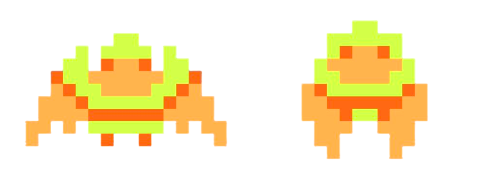

# Video Game Portfolio 

Unity / C# gameplay systems focused on **feedback and iteration**.

---

# GRIDDY | P3 Gold [Showcase Build]

**Endless grid-based tactics roguelike with turn-based and deck-building mechanics.**  
Face off against escalating enemy waves, increasing time pressure, and push for a spot on the leaderboard.

**Play / Download:**  
- [GRIDDY](https://alec-meyer.itch.io/griddy)

## My Contributions [Team Project]

- Created **3D models for player and enemy units** using Blender and integrated them into Unity  
- Designed and implemented **material system and visual identity**, including emissive neon styling and color-coded enemies (white / cyan / magenta / yellow)  
- Built **3D UI elements and in-world visual components**, ensuring readability within a top-down grid-based environment  
- Integrated and tuned **animation systems synced to a global beat clock**, aligning movement and visual rhythm across player and enemies  
- Contributed to **enemy behavior logic and gameplay interactions**, supporting combat clarity and responsiveness  
- Developed and refined **VFX systems**, including laser targeting, hit feedback, and particle effects  
- Implemented **C# gameplay scripts** for animation control, enemy behaviors, and real-time visual feedback systems  
- Managed **Blender → Unity asset pipeline**, including import scaling, materials, and prefab setup  
- Focused heavily on **game feel and visual feedback**, iterating on clarity, responsiveness, and player readability through playtesting  

## Technology

- **Engine:** Unity  
- **Language:** C#  
- **Tools:** Blender (3D modeling), Unity materials + shaders, TextMesh Pro  
- **Systems:** Event-driven architecture, beat-synced animation system, VFX using LineRenderer + particle systems  

## Design Focus

- **Visual Clarity:** readable board state under increasing pressure  
- **Feedback:** strong visual response to player actions (laser, hit, color systems)  
- **Cohesion:** consistent neon aesthetic across models, UI, and effects  

---

# Rover Rush | P2 Gold [Final Prototype]

**Top-down rover defense + base building.**  
Build structures under pressure, manage resources (Sand / Iron / Copper / Gold), and survive escalating bug waves. The rover fabricates placed structures in-world and can be redirected via a waypoint tool for repositioning.

**Play / Download:**  
- [Rover Rush](https://trullin.itch.io/rover-rush)

## My Contributions [Solo]
- Implemented build mode tooling (waypoint + multiple build tools), placement/queue system, and prefab fabrication flow  
- Built rover AI behavior: waypoint driving, build targeting, timed fabrication, and in-world feedback  
- Implemented economy expansion: multi-resource bank, costs per structure, and real-time UI updates  
- Implemented wave director flow: start screen → intro camera sequence → prep/wave cycles → game over  
- Added polish systems: reticle state, “insufficient resources” feedback, and event-driven SFX triggers

## Technology
- **Engine:** Unity  
- **Language:** C#  
- **Systems:** EventBus / Pub-Sub architecture, TMP UI, coroutines + state machines  

---

# The Legend of Zelda | First Dungeon Recreation [P1 Gold]

A faithful recreation of the first dungeon from the original *The Legend of Zelda*, built in Unity as a top-down 2D adventure game inside a 3D environment. Includes a custom mechanic: **Keese Mode**.

**Play:**  
- [Zelda Dungeon](https://trullin.itch.io/trullin-zelda-dungeon)

## My Contributions
- Coroutine-based room transitions between dungeon chambers  
- Environmental mechanics and interaction logic  
- Power-up systems + support work for Link → Keese transformation  
- Designed and built a custom demo map to showcase the Keese mechanic

## Technology
- Unity, C#, Git, Jira sprint planning

---

## Notes 

- Built scalable gameplay systems using event-driven architecture  
- Focused on rapid iteration through playtesting and feedback loops  
- Designed mechanics that balance clarity, pressure, and player agency  
- Experience working in structured sprint cycles with collaborative development workflows  

---

## Play the Demo

You can try the finished build here:

[Zelda Dungeon](https://trullin.itch.io/trullin-zelda-dungeon)
